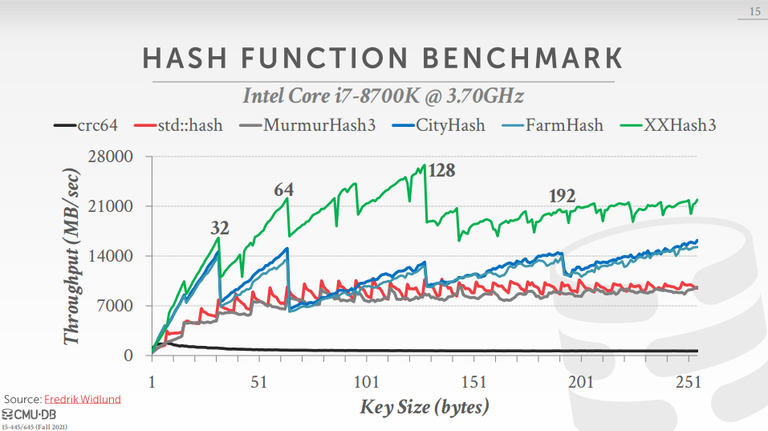

# 知识来源

- CMU 15-445/645 数据库系统导论
- CMU 15-721 高级数据库系统
- MySQL技术内幕InnoDB存储引擎
- 数据库系统概念

# 数据库的基本抽象

数据库系统的构建可以从上到下分为5个层次：

- 查询计划
- 算子执行
- 访问方法
- 缓冲池管理
- 存储管理

CMU的数据库导论课程根据从下到上的顺序构建。存储管理和缓冲池管理存在日志崩溃和恢复问题，算子执行和方法方法存在并发控制问题。

# 存储管理

计算机系统的存储架构按照速度可以进行排序：

- CPU寄存器
- CPU缓存
- 动态内存
- 固态硬盘
- 机械磁盘
- 网络存储

CPU寄存器和CPU缓存是CMU 15-721的主要内容。数据库系统的存储引擎就是存储管理系统。

> 主要知识：

- 数据库中的数据落实到磁盘上，可能是像SQLlite一样的 **单文件** ，也可能是像PostgreSQL一样的 **多文件** ；并且有的数据库系统可能会自研文件系统，但是现代数据库通常不会，因为这样很难被部署到云厂商的服务器上。

- 数据库通常使用“页”这种概念来描述数据块，并且数据库要求数据是“自托管的”，也就是说元数据和数据都应该被管理。每个数据页都会有一个全局唯一的PageID。

- **数据库的元数据存储方式** ：有的数据库的元数据会被单独存储到一个页，数据存储到其他的页，而有的数据库数据和元数据会存储到同一个页（独立的页，self-contained page），因此这有利于 **灾备** ，例如Oracle。

- **操作系统的mmap可能对于数据库系统来说是灾难** ，例如MongoDB的第一版本使用了mmap，研发上做了很多无用功。

- **Indirection 层** 用于实现数据页映射到某个集合中一个文件的具体位置。PageID可以是数据页在对应文件的相对位置，那么知道整体文件的初始位置和数据页大小就可以知道具体的Offset值。
    - 优点：如果整体移动数据文件，例如更换硬盘，那么PageID就可以保持不变了。

- 页的三种概念：
    - 硬件的页： 硬件存储暴露的组织数据存储的概念，并且是 **原子读写** 的数据块大小，**通常是4KB** 。
        - 例如16KB，可能前8KB数据写入了，由于异常，剩余的8KB也写入了，但是不连续，导致是损坏的数据。
    - 操作系统的页：从存储设备上取出数据放到内存中的表示， **通常是4KB** 。
    - 数据库系统的页：通常是512B - 16KB。

- 在存储引擎级别，我们不关心数据页中到底有什么：
    - **堆文件，无序且随机** 。构建这种文件的方式：
        - 数据页头（页的元数据区）中有 **两个指针** ，指向Free页链表和Data页链表。
        - 使用 **Directory** 的概念包装数据页，这个Directory中包含Free页和Data页。
    - 顺序/排序文件
    - 哈希文件

- 数据页大小是固定的，并且要比操作系统和硬件的页更大一些。
    - 如果数据页较小，那么一个PageID所表达的数据范围更小，**页表就会导致膨胀** ，那么就可能会产生缓存丢失， **类似于TLB** 。

- 由于数据库的页一般要比操作系统和硬件存储的页大，那么就出现了一个数据库的页使用随机还是连续的方式落实到下游的页；并且多个下游的数据页如何安全的原子的保存，这样写入数据的代价就会变高，因此商用数据库 **允许应用进行调整** 。
    - 对页的灾备可以使用日志的方式实现。

- 在数据页中存储元组，也就是数据库行记录，那么，可以采用顺序存储，但是存在的问题是删除元组会 **存储空洞** ，因此一个可行的方案是 **Slotted Pages** ，本质是在数据页头区域设置一个 **Slot Array** ，用来记录元组的偏移量。
    - Slotted Pages方案 **无法解决变长元组带来的空间损失** ，因此PostgreSQL提供了 **Vaccum操作** 用于处理这些空间。类似于GC（垃圾回收）。

- 元组的布局方式也分为数据区和元数据区。元组中的数据无论是否对齐，数据都会连续存储，这种模型叫做 **N-ARY模型** 。元组的DML速度很快，但是对于TB级别的数据分析通常只需要几列而不是整个元组读出，因此OLAP数据库中有列式存储。

- 另一种存储方式是采用 **结构化日志** 存储数据而不是页。
    - 优点是便于 **回滚** 且便于操作。
    - 缺点是很 **难读** ，因为追加的是DML语句，也可以经过优化，然后存储被一个DML修改后的数据。

- 如果不想丢失数据的精度，就需要使用 **固定的浮点** 表示数，但是这需要数据库系统去实现。

- 对于大型的二进制数据，可能的方式是 **Overflow Page** 或者 **外部文件** 。
    - 对于移动应用来说，将文件存储到数据库效率更高，因为不需要获取文件描述符等其他指针。

# 缓冲池管理

缓冲池用于存储磁盘加载到内存的数据，但是存储单位是 **Frame** ；Frame对应磁盘上Slot的概念而不是页。

> 主要知识：

- 数据库系统必须通过一个 **Page Table** （实质上是哈希表结构）来维护Frame和Page的关系。Page Table和Page Directory的区别：
    - Page Table是内存中的结构，维护缓冲池与Page ID的映射关系；需要确保是线程安全的。
    - Page Directory是数据库文件的存储结构。

- 数据库系统通常维护一些元数据，例如：
    - Dirty Flag 用于表示缓冲池中的数据是否被修改过。
    - Pin/Ref Count 用于表示占用该Page的线程数量。

- Lock和Latch的区别:
    - Lock是数据库系统的逻辑原语，用于保护数据库的逻辑内容。
    - Latch是一种底层保护原语，用于保护数据库系统物理结构的关键部分（数据结构或者内存中的数据），Latch一般会使用自旋锁。
    - Lock的对象是 **事务** ，Latch的对象是 **线程** 。所以Lock保护的对象是 **数据库数据** ，而Latch是 **内存中的数据结构** 。
    - Lock发生在整个事务过程中，而Latch是产生临界资源的时候。
    - Lock主要的实现是行锁，表锁，意向锁；Latch的主要实现是操作系统级别的**读写锁和互斥量**。
    - Lock的死锁检测手段一般是 **等待图，依赖图或者超时机制** ，Latch一般不存在死锁检测和处理机制，只是通过应用程序加锁顺序保证没有死锁的情况发生。
    - 因此Lock被 **锁管理器（可以实现为一个进程，从事务接收消息并反馈）** 的哈希表所容纳，Latch则在数据库系统实现的代码中。

- 如何为缓冲池分配足够的内存空间?
    - 全局策略：针对整个系统来考虑，所做出的的解决会使得整个系统受益。
    - 局部策略：针对每个查询或者事务来考虑，但是对于整个系统可能是糟糕的。

- 多缓冲池、预读取、扫描共享、缓冲池旁路：
    - 数据库可以存在多个缓冲池，每个缓冲池都有自己的Page Table维护一套Page ID到Frame的映射。这样做是为了 **可以在每个缓冲池上使用局部策略并且减少Latch争用的出现** 。
        - ObjectID：使用 (ObjectID, PageID, SlotNum) 三元组来确定加载哪些数据。这样可以通过ObjectID查询到数据。
        - 哈希表：通过Hash确定缓冲池中的位置，通过取模确定在哪个缓冲池里。、
    - **预读取用于减少查询线程的停顿** ，从而达到 **减少最小化随机IO** 。本质是预测SQL的查询范围和动作意图。
    - **扫描共享用于将一份数据尽可能多的用于多个查询线程**，这不等同于结果缓存。实现上是将多个查询线程附加到当前的 **游标** 数据结构中。
        - 当不同的线程计算相同的数据，那么这些数据可以横跨多个线程共享它们需要的结果，这叫做 **物化视图** 。
        - 完整的方案只有DB2和SQL Server支持，Oracle支持的基本扫描共享技术叫做 **游标共享技术** ，两个线程在同时执行时才会有效。
    - **缓冲池旁路是从本地内存中查找一部分想要的数据并且不污染缓冲池的缓存规律** ，有的系统也叫做Buffer Cache旁路。执行查询时从磁盘将数据 **加载到本地内存而不是缓冲池** ，因为查询缓冲池需要Latch，存在一定的代价，但是这样做只能是 **中间结果和扫描量比较小** 的时候用。
        - 许多数据库系统使用Direct IO跳过操作系统页缓存（操作系统维护的文件系统缓存）。
        - 唯一利用操作系统页缓存的是PostgreSQL，并且为每个线程维护一个很小的缓冲池, 因为设计者从工程师的角度去考虑，但是会降低性能。
            - PostgreSQL提供了pg_prewarm扩展程序实现当用户调用这个函数的时候就会将表的所有数据页放到缓冲池。
            - 某些数据库系统不喜欢操作系统页缓存是由于 **跨平台特性导致不同系统的策略不同，丧失一致性** 。
        - MySQL和Oracle会用所有的系统内存。
        - 通过将 ``/proc/sys/vm/drop_caches`` 就可以强制让操作系统将操作系统页缓存持久化到磁盘。

- 缓冲池替换策略
    - LRU：实现方式是跟踪Page的访问时间戳。
        - LRU-K: 只有最近被访问K次的才可以在缓冲池中。
    - Clock, 与LRU类似,是一种最近未使用算法，即逐出的页面都是最近没有使用的那个。
        - 解决了LRU需要跟踪每个Page的访问时间戳的问题，但是需要维护每个Page的标志位。
        - 需要将Page设置到 **环形的缓冲池** ，有一个旋转的指针来检查哪些Page需要移除。
        - 不会精确的移除最近最少使用的Page。

# 读写方法

- 哈希表：特性决定了只能用来做精确匹配查找。
    - 哈希碰撞问题导致节点上的链表需要花费 O(n) 的时间遍历。因此需要寻找完美的哈希函数。
    - 哈希Schema是遇到哈希碰撞是解决问题的机制，本质上是找不到完美的哈希函数的补救措施，因此哈希表由哈希Schema和哈希函数构成。
    - 静态哈希：
        - 开放寻址法：性能上依然碾压一切。当Value=Hash(Key)时出现冲突，那么以Value为基础产生一个新的哈希值Value1，如果再出现冲突就再重复操作。
        - 拉链法：每个哈希桶下面都有一个链表。
        - 多重哈希法：使用多个不同的哈希函数嵌套哈希计算。
        - 常见的哈希函数实现：
            - CRC-64: 用于网络数据包错误检测。
            - MurmurHash: 快速通用的。
            - Google CityHash: 短Key快速的。
            - Facebook XXHash: 来自zstd压缩的创作者。
            - Google FarmHash: 新版本的City Hash，具有更好的哈希碰撞率。

        

    - 动态哈希
        - 多哈希表：采用多个哈希表来扩展原来的哈希表，多个哈希表公用一个哈希函数。质量达不到数量凑。
            - 桶满时触发新的哈希表创建。

- B+树: 特性决定支持范围查找和模糊匹配。相对Hash表而言，B+ 树无须通过一个具体的Key来查找。
    - 通常Key和Value是分离的，因为便于利用CPU的缓存特性。
    - 通常节点中有两个指针指向相邻的兄弟节点。
    - B+树可以根据层数估算存储的数据量：``((Page大小 - 元数据大小) / 元组大小) ^ 层数``。
    - 实际系统中需要将元组中的那个数据作为RecordID?
        - 指向索引项对应的元组位置的指针。
        - 元组的实际内容存储在叶节点中，二级索引必须将 RecordID 存储为其值。
    - B+ 树与 B 树相比，B+ 树只能将Value存储到叶子节点。
    - 可以在多个列上定义复合索引，**定义顺序影响查找方式** 。
    - 变长字段作为索引键的时候PostgreSQL会使用null或者0填充进行对齐。
    - 如果插入的数据超过varchar的长度，MySQL会默默的切掉后边的数据，而PostgreSQL会给出错误。
    - **Sorted Key Map** 是一种微优化，在内存中处理，将B+树中的节点中的每个元组的前一个字符提取出来使用数组保存，这样查询对比时， **如果第一个字符就不相等，那么可以直接跳过** ，这样可以避免加载很多数据导致缓存失效。
    - B+树上重复的Key如何处理?
        - 插入RecordID
        - 使用溢出叶节点进行垂直扩展

- 聚簇索引: **让数据按照某种方式进行排序，例如主键** 。数据库系统会保证索引会对Page中的元组的物理布局进行重新组织。
    - 如果没有定义主键，MySQL会自动定义一个，对我们是透明的。
    - PostgreSQL并不会按照主键的顺序来排序，如果主键是聚簇索引的排序方式。
    - 也叫做聚集索引，缺点在于更新的代价高，因为需要将数据移动到指定的位置。插入速度严重依赖于插入顺序。更新时可能会导致页分裂问题。聚集索引也可能会导致全表扫描速度变慢，因为逻辑上连续的页在物理上可能相隔较远，产生大量的随机IO。

- 覆盖索引：查询的字段都是索引的字段。

- 优化: 让B+树变得更快.
	- 前缀压缩：多个排序的Key具有相同的前缀可以进行压缩，**使用Trie树** 。
	- 后缀截断：使用 **指定长度的字符串** 就可以判断不同的Key，那么后边没用的截掉就可以。
	- 批量插入：例如批量加载一个数据集，这样就会提前拥有全部的Key，可以 **先进行排序然后再批量插入** 。
	- 指针混用：将B+树中的PageID替换为缓冲池中的指针，这样避免访问缓冲池该Page是否存在。

- 函数/表达式索引：用户不想通过Key来查找记录，而是某种方法。

- Trie树/基数树

# 算子执行

## 排序和聚合

- 执行的逻辑计划产生的结果和中间结果可能无法完整的存储到内存，因此需要利用缓冲池。

- 每个数据库系统都应该支持外部归并排序，将数据集拆分成更小的数据集，然后使用 **2 Way Merge Sort** 进行处理，在处理时每两个小的数据集合并成一个数据集，一种优化IO成本的方式是使用 **Double Buffering** ，在排序第一个Page的时候使用另一个线程读取第二个Page。更加复杂的算法是 **N Way Merge Sort** 。

- 局部的排序需要消耗内存，在PostgreSQL中叫做working memory，这个参数是可配置的。

- 在排序过程中，如果排序的目标是聚簇索引，那么基于索引所在Key进行排序，如果是非聚簇索引，那么很少会这样。

- 外部哈希聚合，类似于外部归并排序，思路是先分区再哈希。

- Join算法
    - **Nested Loop Join** ：两个for循环嵌套，IO成本：
    - **Sort Merge Join** ：没有驱动表，排序后交替执行，IO成本：
    - **Hash Join** ：适用于一个大表一个小表。分为Build和Probe两个阶段，只适用于等值Join。在优化器生成执行计划阶段会识别出哪是小表，扫描小表建立Hash表（Key是Join属性采用Hash函数得到的值），数据量很大的情况下使用Bloom过滤器。然后扫描大表的每一个元组计算Hash值，与小表对比。成本：
        - **Grace Hash Join** ：适用于内存不足的情况，核心逻辑在于分块处理，然后将Bucket写入到磁盘中。IO成本：

## 处理模型

- **迭代器模型**（iterator model、volcano model、pipeline model）
    - 通过Operator调用Next方法实现从根节点到叶子节点的下推，然后每个节点返回元组。
    - 常见的数据库系统都支持此模型，但是 **一些操作符（Join、子查询、Order By）不支持** ，因为它需要从子节点处获取更多的数据。

- **物化模型**
	- 调用Next函数的时候不是只返回一个元组，而是返回全部的元组。
	- **对limit语句不友好** ，很容易加载不必要的数据。
	- **有时对于OLTP是友好的，因为通常OLTP需要加载的数据量较少** 。
	- 一般出现在特定的系统中，因为物化模型更适合面向内存的数据库。

- **向量化模型**
    - 调用Next函数的时候，操作符内部循环一次处理多个元组，个数取决于硬件和查询属性。
    - **对于OLAP是友好的** ，因为通常OLAP需要加载大量的数据集。
    - 是对迭代器模型的增强。

## 访问模型

- 计划执行方向：
	- 自顶向下：适合面向磁盘的数据库，元组与函数调用一起传递。
	- 自底向上：允许更严格的控制Pipeline中的CPU缓存和寄存器。

- 顺序扫描
    - Operator中的一大堆for循环。
    - 优化手段:
        - 预读取
        - 缓冲池旁路
        - 并行
        - Zone Maps：通过计算关于Page的信息来决定是否需要访问这些Page，例如MIN，MAX，COUNT，AVG，SUM等。SQL Server、Amazon RedShift使用了该方式。
        - 延迟物化: 对于一个列式存储系统，可以将数据从一个Operator延迟传播到另一个Operator。
        - 聚簇堆：允许我们从叶节点顺序获取数据。

- 索引扫描：扫描索引而不是直接扫描数据节点避免不必要的IO开销。
    - 多索引扫描：指的是通过不同的索引进行多路查找。PostgreSQL称作Bitmap Scan。
    - 索引扫描页排序：找出所需要的所有Page，然后根据某个属性进行排序。

## 进程模型

- 每个进程负责一个Worker，DB2、Oracle和PostgreSQL使用这种方式。
    - 使用共享内存实现Buffer Pool共享，避免多个进程加载不同的Page。
    - 如果一个进程崩溃了不会影响另一个Worker。

- 每个线程负责一个Worker，MySQL实现了该模型，现代数据库系统一般会使用该模型。
    - 并行intra-query：MySQL 8才实现该方式，通过多个Worker去执行一些请求。
        - 水平的intra operator：将数据拆成若干段，然后每个Worker执行相同的任务，最后通过一个Exchange Operator合并所有的结果。
		- 垂直的intra operator：一个Worker内的任务高内聚，多个Worker之间的任务低耦合。
		- bushy：在同一时刻执行查询计划的不同部分。

- 进程池/线程池，DB2和PostgreSQL实现了该模型。
    - 一些高端的数据库系统可能会实现工作窃取机制。

- Exchange Operator的类型：
	- 聚集：将多个Operator的数据流合并，然后将结果传递给下一个Operator。
	- 再分区
        - 水平分区
		- 垂直分区
    - 分布式的

# 查询计划

- 查询优化本质上有两种类型可以使用：
    - **条件规则触发** ：当执行查询的时候，触发了某些条件规则，然后对SQL进行改进或者重写。
    - 基于成本的搜索：列出一堆查询计划供我们选择执行。我们 **通过某种成本模型进行选择** 。
        - 基于成本模型可以在不用执行查询计划之前就可以知道不同查询计划的成本。
        - 但是没有成本模型的数据库系统可以同时执行多个查询计划，然后返回最快的查询计划返回的结果，MongoDB就是这样做的。
        - 预估执行查询的成本是通过在数据库内部维护表的相关信息完成的。

- 架构：
    - 应用通过发送SQL语句到SQL重写器，SQL重写器是可选的，然后SQL重写器输出SQL查询到解析器，解析器生成AST发送到绑定器，绑定器根据数据库中的定义去修改AST某些值为内部标识符，绑定器会生成逻辑计划送入Tree重写器，Tree重写器是可选的，Tree重写器再次输出逻辑计划到优化器，优化器通常基于成本模型，输出物理计划去执行。
        - ``客户端->SQL重写器->SQL解析器->绑定器->Tree重写器->优化器->执行器``
    - 物理计划中定义了如何使用这些Operator。

- 优化手段：一个关系代数产生的元组与另一个关系代数产生的元组相同，那么可以认为这两个关系代数是等价的。
    - 谓词下推：例如在Join前，将等值语句下推到加载表数据的时候而不是Join后。
        - 有时候会很糟糕，因为某些计算下推后成本更高，例如哈希计算。
    - 选择基数:
        - 统一数据
        - 独立谓词
        - 包含原则
    - 相关属性
    - 左深度连接树：System R的基本决策
        - 可以最小化写入磁盘的数据量
    - 动态编程：计算多个Join之间路径的Cost，选择最小的那个。
    - 遗传查询：PostgreSQL使用的方式，如果表的数量超过12个就会采用该算法，否则就会采用动态编程的方法。
    - 嵌套子查询重写

# 并发控制

- BASE理论: BA指的是 **基本业务可用性，支持分区失败** ，S表示柔性状态，也就是 **允许短时间内不同步** ，E表示最终一致性， **数据最终是一致的** 。原子性和持久性必须从根本上保障，为了可用性、性能和服务降级的需要，只有降低一致性和隔离性的要求。 
  - 不符合ACID的系统通常以BASE冠名。BASE唯一可以做的事情就是不承认ACID，此外没有任何保证。

- CAP定理：对于共享数据系统，最多只能同时拥有CAP其中的两个，任意两个都有其适应的场景，真实的业务系统中通常是ACID与CAP的混合体。分布式系统中最重要的是满足业务需求，而不是追求高度抽象，绝对的系统特性。
    - C表示 **一致性** ，也就是所有用户看到的数据是一样的。CAP只是使用一致性来标识线性化。
    - A表示 **可用性** ，是指总能找到一个可用的数据副本。
    - P表示 **分区容错性** ，能够容忍网络中断等故障。

- 事务：事务是由一组操作构成的可靠的独立的工作单元，事务具备ACID的特性，即 **原子性、一致性、隔离性和持久性** 。它不是天然存在的，目的是简化编程模型。
    - 事务的实现方式：
        - 使用 **重做日志** 保证原子性
        - 使用 **影子分页** 保证原子性，使用指针指向新的Page副本。是System R发明的，现在CouchDB和LMDB(OpenLDAP)在使用。
        - 原子性：银行转账的例子
    - 一致性：用于描述操作前后的 **预期状态** ，从一种状态转变为另一种状态，数据库的完整性约束没有被破坏。一般会通过重做日志来实现。
        - MySQL的重做日志分为Redo和Undo， **Redo具有内存缓冲区** ，Redo保证事务的持久性，是顺序写的。
        - Undo用来实现事务回滚和MVCC。
        - 数据库系统的一致性与分布式系统的一致性：
          - 数据库的一致性在于ACID的一致性，也就是关乎操作的一致性，分布式系统的一致性更加注重数据的一致性。
          - 数据库的一致性核心在于约束，约束是由数据库的使用者告诉数据库系统的。
          - 外部一致性的核心是并发控制，实现外部一致性的核心是可串行化和可线性化。
          - 数据库系统存在事务的并发控制问题，并且ACID的隔离性受到并发控制的影响。
    - 隔离性：要求每个读写事务的对象对其他事务的操作对象互相分离开。事务提交前对其他事务是不可见的。
        - 也叫做并发控制，本质是假装并发没有发生。
        - SQL标准定义的四个隔离级别：
            - **读未提交** ：可以读取其它事务修改但未提交的数据，但是会导致“脏读”、“幻读”和“不可重复读”。
              - **脏读** ：所谓的脏读，其实就是读到了别的事务回滚前的脏数据。比如事务B执行过程中修改了数据X，在未提交前，事务A读取了X，而事务B却回滚了，这样事务A就形成了脏读。
                - 脏读的实现方式可以使用锁，但是读锁并不可行：运行时间较长的写事务会导致读事务等待时间过长。读锁的任何局部性能都会扩散到整个应用。
                - 大部分数据库使用对于每个待更新的对象，数据库会维护其旧值和当前持有锁的事务的新值两个版本。事务提交之前，只读事务能看到的只有旧值。
              - **幻读** ：事务A 按照一定条件进行数据读取， 期间事务B 插入了相同搜索条件的新数据，事务A再次按照原先条件进行读取时，发现了事务B 新插入的数据称为幻读。
              - **不可重复读** ：如果事务A 按一定条件搜索， 期间事务B 删除了符合条件的某一条数据，导致事务A 再次读取时数据少了一条。这种情况称为不可重复读。也叫做 **读倾斜** 。
                - 还有 **写倾斜** 的概念：是一种广义的更新丢失，本质是两个事务更新了两个不同的对象，但是这两个对象又存在关系，写倾斜导致业务上的错误。如果无法使用可串行化的隔离级别，那么应用程序可以显式使用FOR UPDATE加锁。
                - 一些场景无法容忍不可重复读取：备份场景、分析查询（通常需要扫描大半个表）、定期完整性检查。因此通常使用快照隔离级别来解决。
            - **读已提交** ：只能读取其它事务修改并已经提交的数据。避免了“脏读”，但不能避免“幻读”和“不可重复读”。读已提交是大多数主流数据库的默认事务等级。
              - 读数据库时，事务只能看到已经提交成功的数据，避免脏读。
              - 写数据库时，事务只能看到已经提交成功的数据，避免脏写。数据库通常使用行级锁实现。
            - **可重复读** ：锁定已经读取的数据，当前事务提交前其它事务不允许修改。避免了“脏读”和“不可重复读”的情况，但不能避免“幻读”，但是带来了更多的性能损失。
                - Oracle称为可串行化，PostgreSQL和MySQL称为可重复读取。
            - **可串行化** ：读取前锁定所有要读取的数据，当前事务提交前，其它事务不允许修改。最严格的级别，事务串行执行，资源消耗最大。
              - 解决并发问题的最直接原因是避免并发，在一个线程上顺序执行事务，但是这在2007年才被认可。
                - 内存变得便宜。
                - OLTP事务通常很快且以读为主。
              - 数据库系统的可串行化和分布式系统的可线性化：
                - 可串行化保证的是编程模型中的一些约束，这些约束是人为规定的。
                - 可线性化保证的是分布式系统中操作与操作产生的记录是确定一致的，那么就称为可线性化的。
        - SQL标准不存在但是很实用的隔离级别：
          - 快照隔离级别：通常采用写锁方式避免脏写的出现。实现快照隔离级别的这种技术也叫做MVCC。
            - 快照隔离级别的实现过程中需要事务ID，通常事务ID的实现是32位整数，大约在40亿次后出现溢出，因此PostgreSQL提供了类似于垃圾回收的vacuum进程实现清理。
            - 更新事务的有效性检查：
                - 更新丢失：两个事务所拥有的快照是独立的。
                  - 先提交者获胜
                  - 先更新者获胜
                  - 应用层使用FOR UPDATE显式加锁。
                  - 如果不支持内置的原子操作，那么就需要通过读取-修改-写回来避免。内置的原子操作通常使用独占锁实现。
          - 可串行化的快照隔离：SSI算法在2008年才提出。与2PL相比，它是一种乐观的并发控制机制，当事务提交时数据库才会检查是否发生冲突，如果是那么终止并重启。为什么要等到提交?
            - 数据库无法预知当前事务是只读事务还是读写事务。
            - 参与同时执行的事务可能发生终止，因此MVCC机制中读取的值并非一定是旧值。
            - 参与同时执行的读事务在提交时才会通知数据发生了变化。
            - 这样做就不需要等待其他事务所持有的锁。
            - 可串行化隔离突破了单核心CPU的限制。但是事务终止比例仍旧影响SSI算法的表现。
    - 持久性：事务一旦提交，就是永久性的修改。
    - 原子性：银行转账的例子。

- 事务的分类：
    - 扁平事务：最常见的事务，所有的操作都处于同一个层次。
        - **带保存点的扁平事务** ：允许在事务执行过程中回滚到同一个事务的较早状态。当系统发生崩溃时，所有的保存点会丢失，然后需要进行整个事务的重新执行。
    - 链事务：保存点的一个变种，提交一个事务时，释放不需要的数据对象，将必要的处理上下文隐式的传递给下一个要开始的事务。
        - **带有保存点的事务可以回滚到任意保存点，链事务不行** 。
    - 嵌套事务：顶层事务下面有许多子事务，是一棵树。
    - 分布式事务：在分布式环境下运行的扁平事务。允许多个独立的事务资源参与到一个全局的事务中。

- 基于锁的协议
    - 锁类型：为了提高并发能力才将锁划分不同的类型。
        - 共享锁：用来处理读请求。允许升级为独占锁。
        - 独占锁：用来处理写请求。允许降级为共享锁。
        - 意向锁：**支持更细粒度的锁请求** 。
            - 共享意向锁：事务想要若干行的读请求。
            - 独占意向锁：事务想要若干行的读/写请求。
            - 共享独占意向锁：**在以当前节点为根的子树加共享锁，子节点加独占锁** 。

    - 死锁检测：等待图法、依赖图法、超时机制。
        - 等待图需要定期构建。

    - 2PL (两阶段锁协议)：分为 **生长和衰退** 两个阶段。悲观的。先获取到所有的锁，然后访问资源再释放所有的锁。
        - 生长：允许事务向锁管理器申请锁。
        - 衰退：释放锁，然后不允许申请锁。
        - 从时间与锁数量的图形关系来看， **本质是将锁的释放和申请集中到一段小的时间内完成** 。
        - 优点在于 **足以保证可串行化，并且生成的前趋图是无环的** ，缺点在于容易出现 **级联终止** ，也就是当一个事务需要回滚，需要回滚其他事务。
            - 级联终止本身就是终止，终止事务造成的影响：
                - 事务已经执行成功，但是返回客户端失败，那么重试就会造成重复执行。
                - 系统负荷导致重试导致更高的系统负荷，那么需要指数回退等。
                - 临时性故障，例如死锁、网络不稳定、节点切换、隔离违背导致重试，像隔离违背这张永久性故障导致无意义重试。
                - 客户端进行失败导致重试。
            - 严格两阶段锁：**区别就是在衰退阶段可以保持锁（排他锁）的数量，在事务完成后释放锁** 。
                - 如果出现事务写入的值在当前事务完成之前没有被其他事务读取或者覆盖，那么事务调度器实现的2PL是严格的2PL。
            - **强两阶段锁：衰退阶段不允许释放锁** 。

- 时间戳排序协议
    - 另一种决定事务可串行化次序的方式是 **事先选定事务的次序** ，该协议就是这样的。
    - 时间戳的产生：
        - 系统时钟：集群内可能不同步，NTP存在时间差。
        - 逻辑时钟（逻辑计数器）：存储时钟的寄存器超过最大位数后溢出导致重置。
        - 混合方式
    - 不使用锁但是增加了元组的元数据维护工作。
        - **每个元组必须维护最近的写时间戳和读时间戳，以方便与事务的时间戳进行比较** 。
        - 必须拷贝一份原来的数据以支持可重复读。
    - 优化：防止出现一个事务在另一个事务之前更新相同的值。
        - **托马斯写入规则** ：
            - 如果Timestamp(tx) < ReadTimestamp(value) 那么tx终止并回滚
            - 如果Timestamp(tx) < WriteTimestamp(value) 那么tx针对value的写操作不执行并继续处理。

- 基于有效性检测的协议
    - 出现该协议的背景是大部分事务都是只读事务，事务冲突发生的频率较低。
    - 属于乐观的并发协议。
    - 在生命周期中执行2或3个阶段：取决于是只读事务还是更新事务。
        - 读阶段：保存在事务线程的局部变量中。
        - 有效性检查阶段：执行有效性测试。记录了三个时间戳：
            - Start
            - Validation
            - Finish
        - 写阶段：局部变量回写到数据库。
    - 避免了级联回滚：只有写操作的事务实际提交后写操作才发生。
    - 可能产生长事务饿死的现象：**一系列短事务不断的发生冲突，长事务反复重启** 。
        - 事务出现冲突后应该添加暂时的阻塞。

- 多版本并发控制 (MVCC)：需要通过事务ID决定哪些对象可见，因此实现MVCC的过程中需要精心定义规则。
    - 每一个数据项的旧值拷贝保存在系统中，这些问题就可以避免。
    - 每一个写操作都会创建数据的新版本。
    - 支持Time-Travel查询操作，特别适用于金融行业。
        - 这个想法是PostgreSQL提出的，但是很快被PostgreSQL移除，因为这样会导致磁盘爆满，用于不做垃圾回收。
    - 版本存储：
        - 仅追加存储：新版本被追加到同一个表空间中
        - 时间序列存储：旧版本被复制到单独的表空间
        - 增量(Delta)存储：修改后的属性的原始值被复制到单独的增量记录空间中，类似于git diff
    - 垃圾回收：定期做全表扫描。
    - 多版本时间戳排序：
        - 读请求从来不失败且不用等待，典型的数据库系统读多写少。
        - 潜在的操作放大问题：一次操作产生多次磁盘访问操作。
    - 多版本两阶段锁：分为只读事务和更新事务。
        - 更新事务执行强两阶段锁协议。
        - 只读事务执行多版本时间戳排序协议。
    - 如何实现支持MVCC的索引?
        - 索引直接指向对象的所有版本，想办法过滤掉对当前事务ID不可见的数据。随之而来的问题在于删除数据需要设计一个垃圾回收进行索引清理操作。
        - 采用B+ Tree的追加/写时复制技术，当更新是不会修改现有的Page而是创建一个新的修改副本，拷贝必要的内容，然后让父节点或者递归向上，直到树的根节点指向新创建的节点。这样哪些不受更新影响的页面都不需要复制。
            - 在写入事务中，每个时刻都会创建一个新的B+ Tree，代表着这一时刻数据库的一致性快照，这样就无须事务ID了。不过这种方法依然需要设计一个垃圾回收进程实现压缩和GC。

> 下面为扩展知识, 业务系统上的事务支持。

- 本地事务：当事务 **由资源管理器本地管理时** 被称作本地事务。
    - 本地事务的优点就是 **支持严格的ACID特性** ，高效，可靠，状态可以只在资源管理器中维护，而且应用编程模型简单。
    - 本地事务不具备分布式事务的处理能力， **隔离的最小单位受限于资源管理器** 。

- 全局事务：当事务 **由全局事务管理器进行全局管理时** 成为全局事务，事务管理器负责管理全局的事务状态和参与的资源，协同资源的一致提交回滚。

- TX协议：应用或者应用服务器与事务管理器的接口。

- XA协议：**全局事务管理器与资源管理器的接口** 。XA是由X/Open组织提出的分布式事务规范。该规范主要定义了全局事务管理器和局部资源管理器之间的接口。主流的数据库产品都实现了XA接口。XA接口是一个双向的系统接口，在事务管理器以及多个资源管理器之间作为通信桥梁。之所以需要XA是因为在分布式系统中从理论上讲两台机器是无法达到一致性状态的，因此引入一个单点进行协调。由全局事务管理器管理和协调的事务可以跨越多个资源和进程。全局事务管理器一般使用XA二阶段协议与数据库进行交互。

- AP：应用程序，可以理解为使用DTP（Data Tools Platform）的程序。

- RM：资源管理器，这里可以是一个DBMS或者消息服务器管理系统，应用程序通过资源管理器对资源进行控制，资源必须实现XA定义的接口。资源管理器负责控制和管理实际的资源。

- TM：事务管理器，负责协调和管理事务，提供给AP编程接口以及管理资源管理器。事务管理器控制着全局事务，管理事务的生命周期，并且协调资源。

- 2PC (两阶段提交协议)：XA用于在全局事务中协调多个资源的机制。TM和RM之间采取两阶段提交的方案来解决一致性问题。两节点提交需要一个协调者（TM）来掌控所有参与者（RM）节点的操作结果并且指引这些节点是否需要最终提交。说白了就是引入了协调者这个角色保证数据的强一致性。
    - 两阶段提交的局限在于协议成本，准备阶段的持久成本，全局事务状态的持久成本，潜在故障点多带来的脆弱性，准备后，提交前的故障引发一系列隔离与恢复难题。
    - 缺点：参与的节点都是同步阻塞的，协调者存在单点故障，Commit时协调者故障导致数据不一致。

- 3PC (三阶段提交协议)：将提交事务请求的过程分成canCommit和preCommit两个过程。
    - preCommit可能的情况为执行事务提交进入doCommit阶段和中断事务。
    - 进入doCommit之后可能存在协调者出现问题或者网络问题，这样只能设计一个超时机制。
    - 优点：降低了2PC参与者的阻塞范围，单点故障后继续可以达成一致。
    - 缺点：参与者接收到preCommit消息之后，如果出现网络分区，此时事务依然会提交，这种情况下出现不一致。

- 业务系统中柔性事务的服务模式
    - 可查询操作：服务操作具有全局唯一的标识，操作唯一的确定的时间。
    - 幂等操作：重复调用多次产生的业务结果与调用一次产生的结果相同。一是通过业务操作实现幂等性，二是系统缓存所有请求与处理的结果，最后是检测到重复请求之后，自动返回之前的处理结果。
    - TCC操作：
        - Try阶段，尝试执行业务，完成所有业务的检查，实现一致性；预留必须的业务资源，实现准隔离性。
        - Confirm阶段：真正的去执行业务，不做任何检查，仅适用Try阶段预留的业务资源，Confirm操作还要满足幂等性。
        - Cancel阶段：取消执行业务，释放Try阶段预留的业务资源，Cancel操作要满足幂等性。
        - TCC与2PC(两阶段提交)协议的区别：
            - TCC位于业务服务层而不是资源层，TCC没有单独准备阶段，Try操作兼备资源操作与准备的能力。
            - TCC中Try操作可以灵活的选择业务资源，锁定粒度。
            - TCC的开发成本比2PC高。实际上TCC也属于两阶段操作，但是TCC不等同于2PC操作。
        - TCC对业务服务代码侵入性较高，维护成本也随之上去了。try/confirm/cancel必须实现幂等性。事务管理器的实现需要日志，拉长了TCC整个过程。
    - 可补偿操作：
        - Do阶段：真正的执行业务处理，业务处理结果外部可见。
        - Compensate阶段：抵消或者部分撤销正向业务操作的业务结果，补偿操作满足幂等性。
            - 约束：补偿操作在业务上可行，由于业务执行结果未隔离或者补偿不完整带来的风险与成本可控。实际上，TCC的Confirm和Cancel操作可以看做是补偿操作。
    - Saga操作：Saga在1987年提出，由一系列本地事务构成，从架构上讲分为中心化的（基于事件）和去中心化的（基于命令）。
        - 事件模式：一个本地事务执行完成之后发出命令，挂载该事件的本地事务执行，回滚的实现需要业务提供补偿接口。但是参与的业务方较多的时候会导致失控。大家随意挂载事件，还可能引发环形事件。
        - 命令模式：定义一个与业务无关的服务作为事务的协调者。解决了事件模式的缺点带来的问题是需要维护一个协调中心。

# 日志与崩溃恢复

- 故障分类:
    - 事务故障
        - 逻辑错误：例如事务违反了完整性约束导致无法完成。
        - 内部状态错误：例如死锁。
    - 系统故障
    - 存储故障

- 缓冲池策略：如何使用Undo和Redo取决于我们如何管理Buffer Pool中的脏页。
    - 缓冲池是按照页来从磁盘加载数据的，因此回写的时候也需要按照页为单位落盘。
    - Steal：**允许将未提交的页持久化到磁盘** 。对应的还有No Steal。
    - Force：**允许事务提交前，事务所做的所有更新都落盘** 。对应的还有No Force。
    - No Steal + Force：多个事务修改同一个元组的不同列，当一个事务需要Commit，那么就拷贝该元组并落盘。
        - 并发协议中的CPU成本。
        - 更新多个Page，硬件上无法保证原子性。
        - 频繁的IO读写，导致SSD报废更快。
        - 缓冲池的频繁拷贝导致内存不足，然后产生更多的IO读写。

- 影子分页：将未提交的修改保存到临时空间，当系统崩溃后只需要忽略临时Buffer中的修改即可。
    - 复制的成本太高。
    - IBM和SQLite都在后来放弃了该方式。

- 预写日志（WAL）：使用Steal + No Force的缓冲池策略。
    - 任何修改都保证在修改之前先记录到WAL并落盘。
    - 只是追加，所以是顺序IO。
    - WAL保存到Page中而不是单独的文件，否则操作的成本会变高。
        - LevelDB、RocksDB、Cassandra使用这种日志存储。
        - WAL刷完磁盘的时机就是Commit被提交到磁盘的时机。
        - 会一直变大。

- 日志方案
    - 逻辑日志
        - 需要在每个日志记录中写入更少的数据。
        - 如果有并发事务，很难使用逻辑日志实现恢复。
            - 很难确定数据库哪些部分可能在崩溃前被查询修改过。
            - 恢复时间长，必须重新执行每个事务。
    - 物理日志: 例如 ``git diff``
    - 混合日志: 允许高层操作，但是也可以记录一些底层信息。

- 检查点：对WAL的垃圾回收。

- IBM发布的ARIES是一篇关于崩溃恢复的论文。
    - WAL
    - 重做时重复历史
    - 撤销时使用日志记录变化
